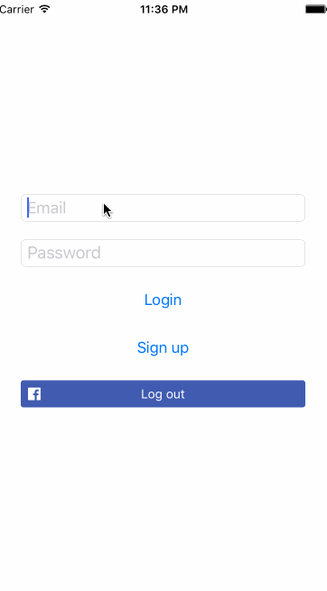

# Lab 3 - ChatWParse

ChatWParse is an app to build a chat client using Parse to explore the features of its ORM and backend service. 

Learned: We'll find that the ORM has many parallels with Core Data, the iOS persistence framework. We'll explore how to work with schema, creating and querying objects, and user authentication.

Time spent: 2 hours spent in total

## User Stories

The following **required** functionality is completed:

- [x] Setup and configure Parse into the app
- [x] Login and Signup
- [x] Create a new message in Parse
- [x] Pull down all messages from Parse every second
- [x] Associate users with messages
- [x] Add Logout 

The following **optional** features are implemented:

- [ ] Link to Facebook account (https://parse.com/docs/ios/guide#users-facebook-users): In progress.  

The following **additional** features are implemented:

- [ ] List anything else that you can get done to improve the app functionality!

Please list two areas of the assignment you'd like to **discuss further with your peers** during the next class (examples include better ways to implement something, how to extend your app in certain ways, etc):

1. Get to know about Parse

## Video Walkthrough

Here's a walkthrough of implemented user stories:

GIF created with [LiceCap](http://www.cockos.com/licecap/).

## Notes

Describe any challenges encountered while building the app.

## License

    Copyright 2016 Nhung Huynh

    Licensed under the Apache License, Version 2.0 (the "License");
    you may not use this file except in compliance with the License.
    You may obtain a copy of the License at

        http://www.apache.org/licenses/LICENSE-2.0

    Unless required by applicable law or agreed to in writing, software
    distributed under the License is distributed on an "AS IS" BASIS,
    WITHOUT WARRANTIES OR CONDITIONS OF ANY KIND, either express or implied.
    See the License for the specific language governing permissions and
    limitations under the License.